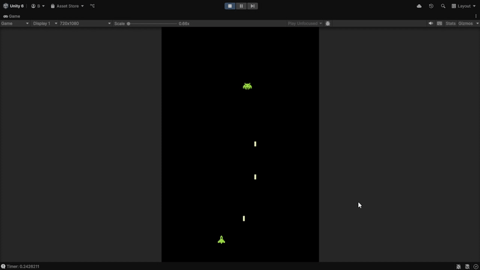
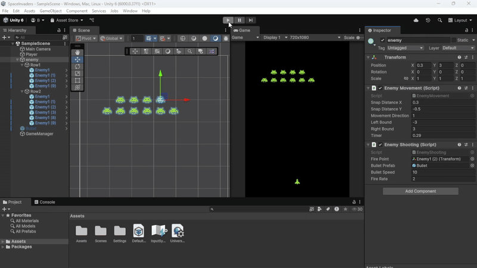
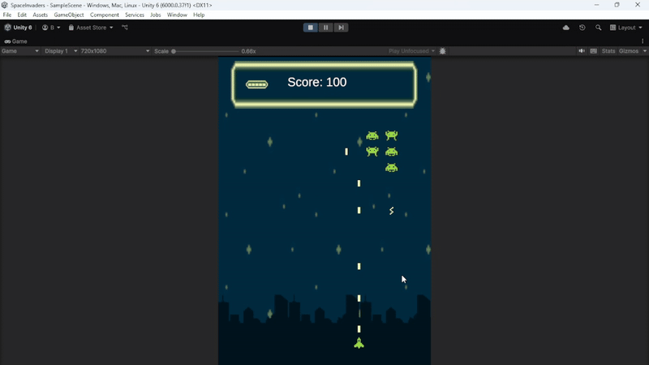
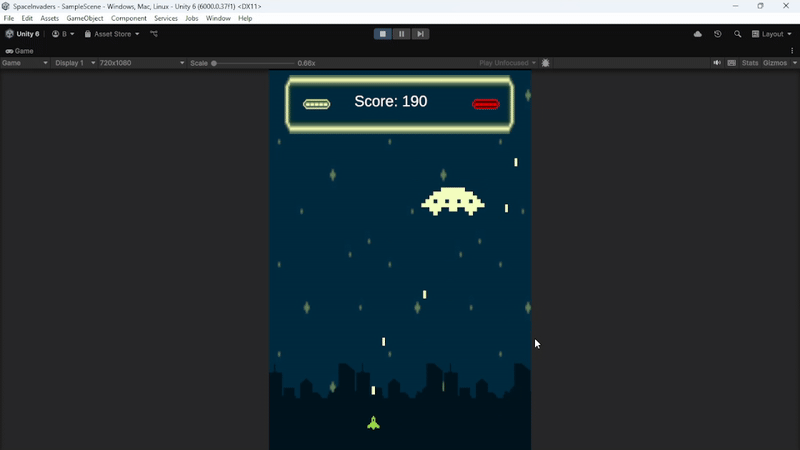
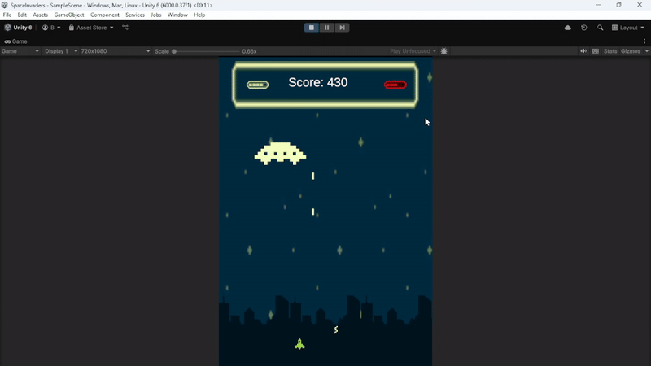
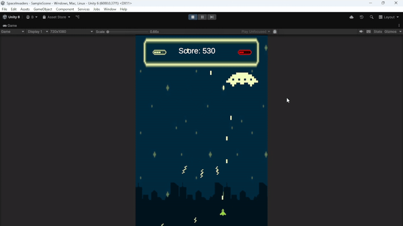

# Space Invaders - Game3

🚀 Space Invaders - Game 3

A modern remake of the classic Space Invaders, built in Unity (C#) with enhanced enemy logic, player controls, and a boss battle system.
This project was focused on building robust gameplay systems — player control, optimized enemy behavior, and multi-phase boss encounters.

🎮 Features
**🧑‍🚀 Player**

Smooth horizontal movement with responsive shooting mechanics.

Shooting cooldown

Player movement and actions can be paused dynamically (used in boss intro).

**👾 Enemy Logic**

Enemies move in synchronized patterns, just like the original Space Invaders.

Optimized Movement Algorithm:
Instead of checking every enemy to detect screen bounds, the system tracks only the leftmost and rightmost enemies in each row.

When an edge is reached, the entire formation shifts down.

If an enemy on the edge dies, the system recalculates the new extreme enemies automatically.

**💥 Enemy Shooting System**

Only the lowest visible enemy in each column can shoot.

When the lowest enemy dies, the one directly above it becomes active and starts shooting.

Ensures realistic, fair shooting behavior like the original arcade feel.

**🛸 Boss Battle**

Cinematic intro animation with player pause.

Multiple attack phases and patterns, including projectile waves, shield mechanics, and repositioning attacks.

Transition logic between phases and clear telegraphs for attacks.

BossIntro:

Boss Phase 1

Boss Phase 2-3

Boss Phase 4

**🛠️ Tech Stack**

Unity 2022

C#

Unity Animator & State Machines

Git for version control

**🎯 What I Focused On**

Writing clean, reusable, and optimized code for enemy management.

Designing an AI-driven shooting and movement system.

Implementing state-based boss logic (intro, attack, shield, phase transitions).

Handling game flow (pausing player, transitions, and battle triggers).

**✅ How to Run**

Clone this repository.

Open the project in Unity 2022 or later.

Run the MainScene from the Scenes folder.
